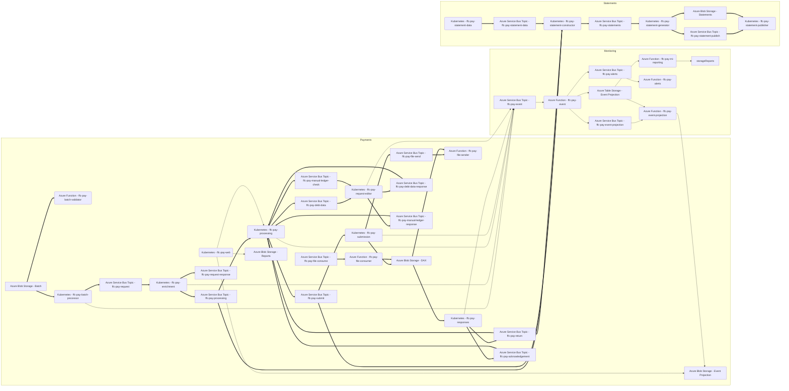

# FFC Pay Core
Local development support for orchestrating all FFC payment and statement microservices.

## Prerequisites

Ensure you have satisfied the prerequisites of all individual repositories.

## Repositories
### Payments
#### Processing
- [ffc-pay-batch-validator](https://github.com/defra/ffc-pay-batch-validator)
- [ffc-pay-batch-processor](https://github.com/defra/ffc-pay-batch-processor)
- [ffc-pay-enrichment](https://github.com/defra/ffc-pay-enrichment)
- [ffc-pay-processing](https://github.com/defra/ffc-pay-processing)
- [ffc-pay-submission](https://github.com/defra/ffc-pay-submission)
- [ffc-pay-responses](https://github.com/defra/ffc-pay-responses)
- [ffc-pay-request-editor](https://github.com/defra/ffc-pay-request-editor)
- [ffc-pay-web](https://github.com/defra/ffc-pay-web)
- [ffc-pay-file-sender](https://github.com/defra/ffc-pay-file-sender)
- [ffc-pay-file-consumer](https://github.com/defra/ffc-pay-file-consumer)

#### Monitoring
- [ffc-pay-event](https://github.com/defra/ffc-pay-event)
- [ffc-pay-event-projection](https://github.com/defra/ffc-pay-event-projection)
- [ffc-pay-alerts](https://github.com/defra/ffc-pay-alerts)
- [ffc-pay-mi-reporting](https://github.com/defra/ffc-pay-mi-reporting)

### Statements
- [ffc-pay-statement-data](https://github.com/defra/ffc-pay-statement-data)
- [ffc-pay-statement-constructor](https://github.com/defra/ffc-pay-statement-constructor)
- [ffc-pay-statement-generator](https://github.com/defra/ffc-pay-statement-generator)
- [ffc-pay-statement-publisher](https://github.com/defra/ffc-pay-statement-publisher)

## Sequence

