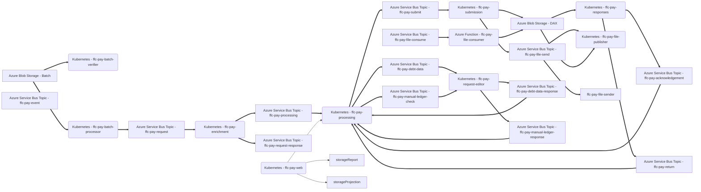
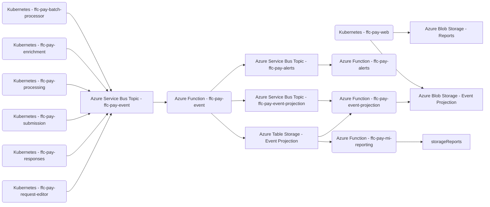
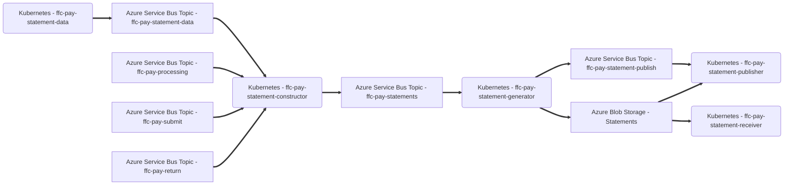

# FFC Pay Core
Local development support for orchestrating all FFC payment and statement microservices.

## Prerequisites

Ensure you have satisfied the prerequisites of all individual repositories.

## Repositories
### Payments
#### Processing
- [ffc-pay-batch-verifier](https://github.com/defra/ffc-pay-batch-verifier)
- [ffc-pay-batch-processor](https://github.com/defra/ffc-pay-batch-processor)
- [ffc-pay-enrichment](https://github.com/defra/ffc-pay-enrichment)
- [ffc-pay-processing](https://github.com/defra/ffc-pay-processing)
- [ffc-pay-submission](https://github.com/defra/ffc-pay-submission)
- [ffc-pay-responses](https://github.com/defra/ffc-pay-responses)
- [ffc-pay-request-editor](https://github.com/defra/ffc-pay-request-editor)
- [ffc-pay-web](https://github.com/defra/ffc-pay-web)
- [ffc-pay-file-publisher](https://github.com/defra/ffc-pay-file-publisher)
- [ffc-pay-file-consumer](https://github.com/defra/ffc-pay-file-consumer)

#### Monitoring
- [ffc-pay-event](https://github.com/defra/ffc-pay-event)
- [ffc-pay-event-projection](https://github.com/defra/ffc-pay-event-projection)
- [ffc-pay-alerts](https://github.com/defra/ffc-pay-alerts)
- [ffc-pay-mi-reporting](https://github.com/defra/ffc-pay-mi-reporting)

### Statements
- [ffc-pay-statement-data](https://github.com/defra/ffc-pay-statement-data)
- [ffc-pay-statement-constructor](https://github.com/defra/ffc-pay-statement-constructor)
- [ffc-pay-statement-generator](https://github.com/defra/ffc-pay-statement-generator)
- [ffc-pay-statement-publisher](https://github.com/defra/ffc-pay-statement-publisher)
- [ffc-pay-statement-receiver](https://github.com/defra/ffc-pay-statement-receiver)

## Sequence

### Payments

### Monitoring

### Statements

## Scripts

### Clone

Clone all repositories from GitHub.  Repositories will cloned in the parent directory of this repository.

[`./clone`](clone)

### Update

Switch to `main` branch in every repository and pull latest changes with `git pull`.

[`./update`](update)

### Build

Build/rebuild Docker container for all microservices.

[`./build`](build)

### Start

Run all payment services.

[`./start`](start)

#### Optional arguments
- `-f` - include Azure Functions
- `-s` - include Statement services
- `-S` - only statement services

### Stop

Run all payment services.

[`./stop`](stop)

#### Optional arguments

Any valid `docker-compose down` argument.

### Open

Open all payment services in Visual Studio Code.

[`./open`](open)

#### Optional arguments
- `-f` - include Azure Functions
- `-s` - include Statement services
- `-S` - only statement services

### Latest versions

List latest GitHub release version for each microservice.

[`./latest-versions`](latest-versions)

### Environment versions

List current environment version for each microservice hosted in Kubernetes.

[`./environment-versions`](environment-versions)

#### Options
- `-c | --cluster` - Kubernetes cluster context name
- `-n | --namespace` - Kubernetes namespace

## Resources
### Payments

A set of test datasets and scripts to support testing of payments.

### Statements

A set of test datasets and scripts to support testing of statements.

Instructions for use can be read [here](resources/testing/statements/Instructions.md).
