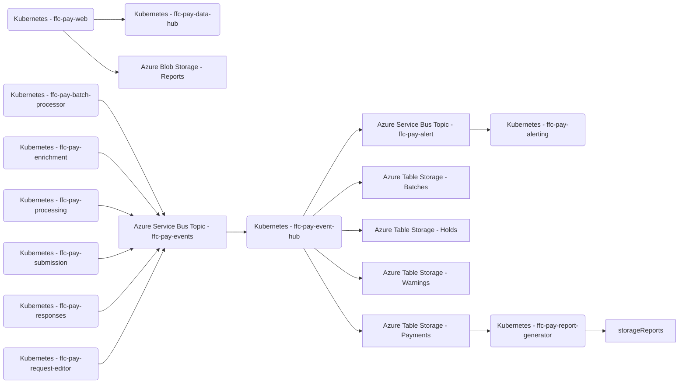

# Payment Hub Core

Local development support for orchestrating all Payment Hub microservices.

## Prerequisites

Ensure you have satisfied the prerequisites of all individual repositories.

## Repositories

### Payments

#### Processing

- [ffc-pay-gateway](https://github.com/defra/ffc-pay-gateway)
- [ffc-pay-batch-verifier](https://github.com/defra/ffc-pay-batch-verifier)
- [ffc-pay-batch-processor](https://github.com/defra/ffc-pay-batch-processor)
- [ffc-pay-enrichment](https://github.com/defra/ffc-pay-enrichment)
- [ffc-pay-processing](https://github.com/defra/ffc-pay-processing)
- [ffc-pay-submission](https://github.com/defra/ffc-pay-submission)
- [ffc-pay-tracking](https://github.com/defra/ffc-pay-tracking)
- [ffc-pay-responses](https://github.com/defra/ffc-pay-responses)
- [ffc-pay-request-editor](https://github.com/defra/ffc-pay-request-editor)
- [ffc-pay-web](https://github.com/defra/ffc-pay-web)
- [ffc-pay-file-publisher](https://github.com/defra/ffc-pay-file-publisher)
- [ffc-pay-file-receiver](https://github.com/defra/ffc-pay-file-receiver)
- [ffc-pay-injection](https://github.com/defra/ffc-pay-injection)
- [ffc-pay-xb](https://github.com/defra/ffc-pay-xb)
- [ffc-pay-dps](https://github.com/defra/ffc-pay-dps)
- [ffc-pay-demographics](https://github.com/defra/ffc-pay-demographics)
- [ffc-pay-fdmr](https://github.com/defra/ffc-pay-fdmr)

#### Monitoring

- [ffc-pay-event-hub](https://github.com/defra/ffc-pay-event-hub)
- [ffc-pay-data-hub](https://github.com/defra/ffc-pay-data-hub)
- [ffc-pay-alerting](https://github.com/defra/ffc-pay-alerting)
- [ffc-pay-report-generator](https://github.com/defra/ffc-pay-report-generator)

### Statements

- [ffc-doc-statement-data](https://github.com/defra/ffc-doc-statement-data)
- [ffc-doc-statement-constructor](https://github.com/defra/ffc-doc-statement-constructor)
- [ffc-doc-statement-generator](https://github.com/defra/ffc-doc-statement-generator)
- [ffc-doc-statement-publisher](https://github.com/defra/ffc-doc-statement-publisher)
- [ffc-pay-statement-receiver](https://github.com/defra/ffc-pay-statement-receiver)

## Sequence

### Payments



```mermaid
flowchart LR
ffc-pay-gateway(Kubernetes - ffc-pay-gateway)
ffc-pay-batch-verifier(Kubernetes - ffc-pay-batch-verifier)
ffc-pay-batch-processor(Kubernetes - ffc-pay-batch-processor)
ffc-pay-enrichment(Kubernetes - ffc-pay-enrichment)
ffc-pay-processing(Kubernetes - ffc-pay-processing)
ffc-pay-submission(Kubernetes - ffc-pay-submission)
ffc-pay-responses(Kubernetes - ffc-pay-responses)
ffc-pay-request-editor(Kubernetes - ffc-pay-request-editor)
ffc-pay-web(Kubernetes - ffc-pay-web)
ffc-pay-file-publisher(Kubernetes - ffc-pay-file-publisher)
ffc-pay-file-receiver(Kubernetes - ffc-pay-file-receiver)
ffc-pay-injection(Kubernetes - ffc-pay-injection)

storageBatch[Azure Blob Storage - Batch]
storageManual[Azure Blob Storage - Manual]
storageDAX[Azure Blob Storage - DAX]

topicRequest[Azure Service Bus Topic - ffc-pay-request]
topicResponse[Azure Service Bus Topic - ffc-pay-request-response]
topicProcessing[Azure Service Bus Topic - ffc-pay-processing]
topicSubmit[Azure Service Bus Topic - ffc-pay-submit]
topicFileSend[Azure Service Bus Topic - ffc-pay-file-send]
topicFileConsume[Azure Service Bus Topic - ffc-pay-file-consume]
topicReturn[Azure Service Bus Topic - ffc-pay-return]
topicAck[Azure Service Bus Topic - ffc-pay-acknowledgement]
topicDebt[Azure Service Bus Topic - ffc-pay-debt-data]
topicDebtResponse[Azure Service Bus Topic - ffc-pay-debt-data-response]
topicLedger[Azure Service Bus Topic - ffc-pay-manual-ledger-check]
topicLedgerResponse[Azure Service Bus Topic - ffc-pay-manual-ledger-response]
topicEvent[Azure Service Bus Topic - ffc-pay-event]

ffc-pay-gateway ==> storageBatch
storageBatch ==> ffc-pay-batch-verifier
storageBatch ==> ffc-pay-batch-processor
ffc-pay-batch-processor ==> topicRequest
topicRequest ==> ffc-pay-enrichment
ffc-pay-enrichment ==> topicResponse
ffc-pay-enrichment ==> topicProcessing
topicProcessing ==> ffc-pay-processing
ffc-pay-processing ==> topicSubmit
topicSubmit ==> ffc-pay-submission
ffc-pay-submission ==> storageDAX
ffc-pay-submission ==> topicFileSend
topicFileSend ==> ffc-pay-file-sender
topicFileSend ==> ffc-pay-file-publisher
storageDAX ==> ffc-pay-file-publisher
storageDAX ==> ffc-pay-gateway
storageManual ==> ffc-pay-injection
ffc-pay-injection ==> topicRequest

topicFileConsume ==> ffc-pay-file-receiver
ffc-pay-file-consumer ==> storageDAX
storageDAX ==> ffc-pay-responses
ffc-pay-responses ==> topicAck
ffc-pay-responses ==> topicReturn
topicAck ==> ffc-pay-processing
topicReturn ==> ffc-pay-processing

ffc-pay-processing ==> topicDebt
ffc-pay-processing ==> topicLedger
topicDebt ==> ffc-pay-request-editor
topicLedger ==> ffc-pay-request-editor
ffc-pay-request-editor ==> topicDebtResponse
ffc-pay-request-editor ==> topicLedgerResponse
topicDebtResponse ==> ffc-pay-processing
topicLedgerResponse ==> ffc-pay-processing

ffc-pay-web --> ffc-pay-processing
ffc-pay-web --> storageReport
ffc-pay-web --> storageProjection
```

### Monitoring



### Statements

```mermaid
flowchart LR

ffc-doc-statement-data(Kubernetes - ffc-doc-statement-data)
ffc-doc-statement-constructor(Kubernetes - ffc-doc-statement-constructor)
ffc-doc-statement-generator(Kubernetes - ffc-doc-statement-generator)
ffc-doc-statement-publisher(Kubernetes - ffc-doc-statement-publisher)
ffc-pay-statement-receiver(Kubernetes - ffc-pay-statement-receiver)

storageStatements[Azure Blob Storage - Statements]

topicProcessing[Azure Service Bus Topic - ffc-pay-processing]
topicSubmit[Azure Service Bus Topic - ffc-pay-submit]
topicReturn[Azure Service Bus Topic - ffc-pay-return]
topicStatementData[Azure Service Bus Topic - ffc-doc-statement-data]
topicStatements[Azure Service Bus Topic - ffc-pay-statements]
topicStatementPublish[Azure Service Bus Topic - ffc-doc-statement-publish]

ffc-doc-statement-data ==> topicStatementData
topicStatementData ==> ffc-doc--statement-constructor
topicProcessing ==> ffc-doc-statement-constructor
topicSubmit ==> ffc-doc-statement-constructor
topicReturn ==> ffc-doc-statement-constructor
ffc-doc-statement-constructor ==> topicStatements
topicStatements ==> ffc-doc-statement-generator
ffc-doc-statement-generator ==> topicStatementPublish
ffc-doc-statement-generator ==> storageStatements
topicStatementPublish ==> ffc-doc-statement-publisher
storageStatements ==> ffc-doc-statement-publisher
storageStatements ==> ffc-pay-statement-receiver
```

## Scripts

### Clone

Clone all repositories from GitHub. Repositories will cloned in the parent directory of this repository.

[`./clone`](clone)

### Update

Switch to `main` branch in every repository and pull latest changes with `git pull`.

[`./update`](update)

### Build

Build/rebuild Docker container for all microservices.

[`./build`](build)

### Start

Run all payment services.

Runs `Seed` script if `ffc-pay-scripts` repository is cloned.

[`./start`](start)

#### Optional arguments

- `-f` - include Azure Functions
- `-s` - include Statement services
- `-S` - only statement services

### Stop

Run all payment services.

[`./stop`](stop)

#### Optional arguments

Any valid `docker compose down` argument.

### Seed

Seed customer mapping data from private repository to `ffc-pay-enrichment` if `ffc-pay-scripts` repository is cloned.

[`./seed`](seed)

### Open

Open all payment services in Visual Studio Code.

[`./open`](open)

#### Optional arguments

- `-f` - include Azure Functions
- `-s` - include Statement services
- `-S` - only statement services

### Latest versions

List latest GitHub release version for each microservice.

[`./latest-versions`](latest-versions)

### Environment versions

List current environment version for each microservice hosted in Kubernetes.

[`./environment-versions`](environment-versions)

#### Options

- `-c | --cluster` - Kubernetes cluster context name
- `-n | --namespace` - Kubernetes namespace

### Resource quota

Determine the Kubernetes resource usage for a namespace based on all microservices running at maximum capacity and scaling.

[`./resource-quota`](resource-quota)

## Resources

### Payments

A set of test datasets and scripts to support testing of payments.

### Statements

A set of test datasets and scripts to support testing of statements.

Instructions for use can be read [here](resources/testing/statements/Instructions.md).
